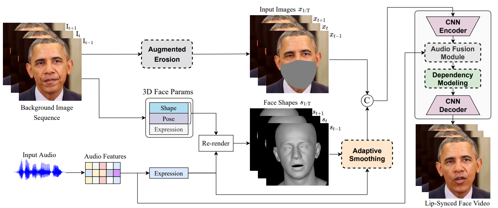
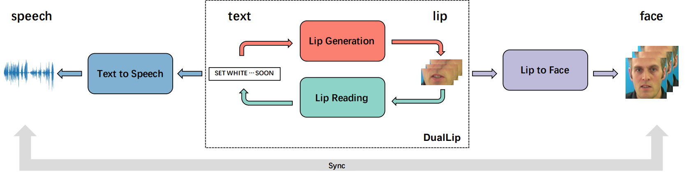

  
---

   
     
  <video src="../images/StableFace.mp4" width="90%" align="center" allowfullscreen controls></video>
  <h3><a href="https://arxiv.org/abs/2208.13717">
  StableFace: Analyzing and Improving Motion Stability for Talking Face Generation, arXiv 2022</a></h3>

 

---

   
   
  <h3><a href="https://arxiv.org/abs/2009.05784">
  DualLip: A System for Joint Lip Reading and Generation, ACM Multimedia 2020</a></h3>

 

 

