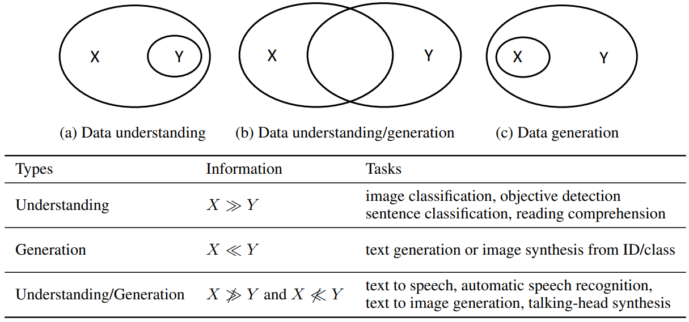
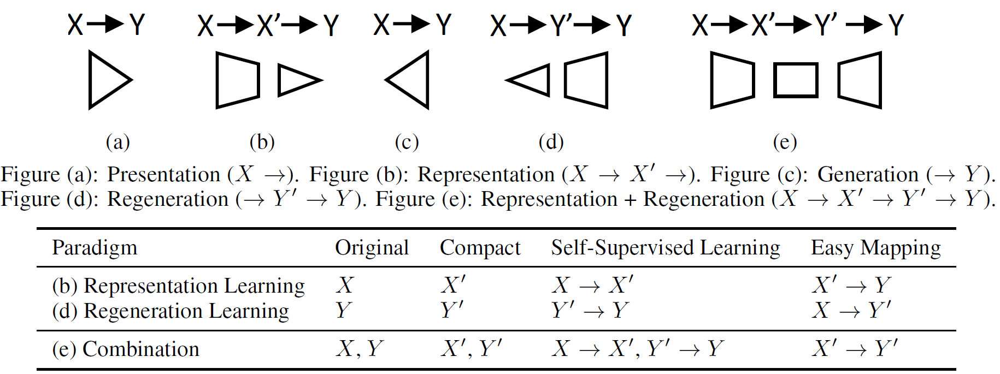
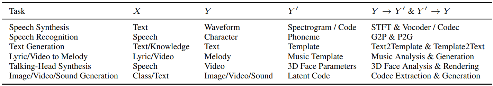
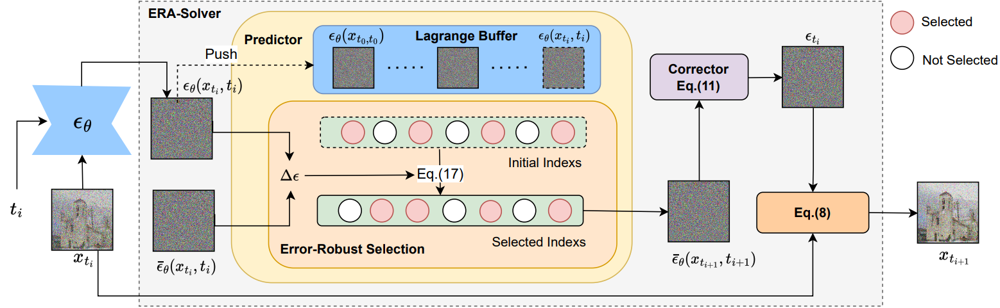
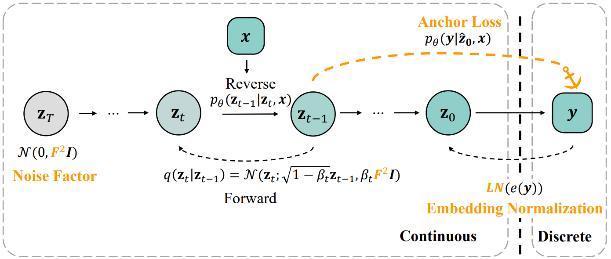

  
  
<h2> Regeneration Learning </h2>

  <a href="https://arxiv.org/abs/2301.08846">
   
       
   
       
  </a>
     
  <h3><a href="https://arxiv.org/abs/2301.08846">
  Regeneration Learning: A Learning Paradigm for Data Generation</a></h3>

 

----

<h2> Transformer as Memories </h2>

    
  <h3>Transformer: <a href="https://arxiv.org/abs/2302.06461">A Study on ReLU and Softmax in Transformer</a></h3>
  <h3>Speech Synthesis: <a href="https://arxiv.org/abs/2205.04421">NaturalSpeech (MemoryVAE)</a></h3>
  <h3>Speech Synthesis: <a href="https://arxiv.org/abs/2204.00436">AdaSpeech 4 (Speaker Memory)</a></h3>
  <h3>Text Generation: <a href="https://arxiv.org/abs/2301.12866">nkNN-NMT (n-gram kNN Memory)</a></h3>
  <h3>Text Generation: <a href="">Extract and Attend (Dictionary as Memory)</a></h3>
  <h3>Talking-Face Video Synthesis: <a href="https://arxiv.org/abs/2212.05005">MemFace (Memories as One-to-Many Alleviators)</a></h3>

 

----

<h2> Diffusion Models </h2>

  <h3>Speedup: <a href="https://arxiv.org/abs/2106.06406">PriorGrad</a>, <a href="https://arxiv.org/abs/2202.03751">InferGrad</a>, <a href="https://arxiv.org/abs/2212.14518">ResGrad</a></h3>
   
   
   
  <h3>Speedup: <a href="https://arxiv.org/abs/2301.12935">ERA-Solver</a></h3>
   
   
   
  <h3>Diffusion for Discrete Token Generation: <a href="https://arxiv.org/abs/2212.09412">Difformer</a></h3>

 

