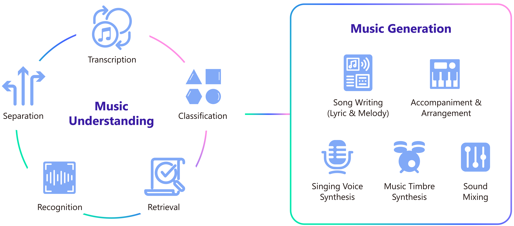
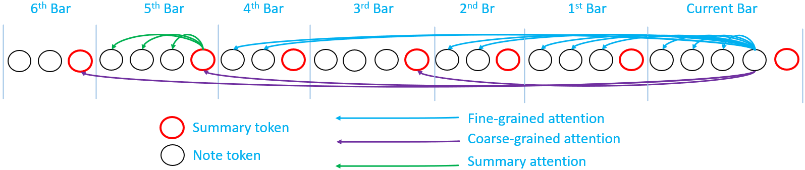
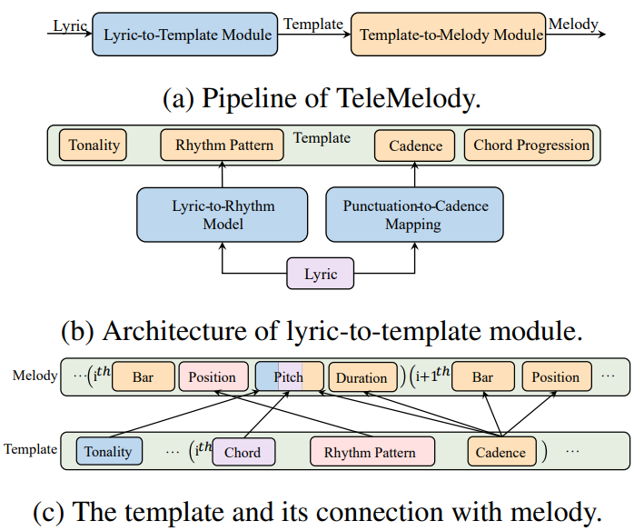
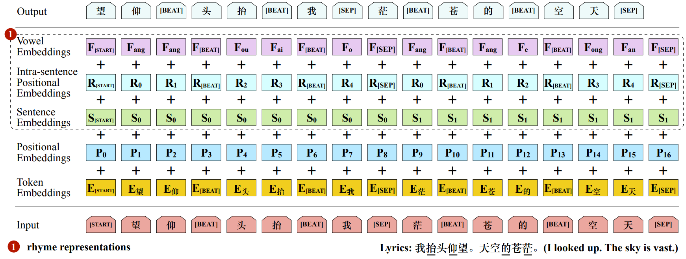
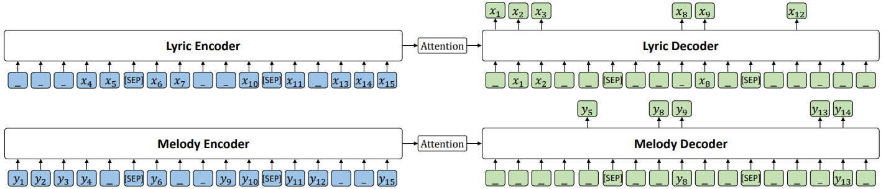
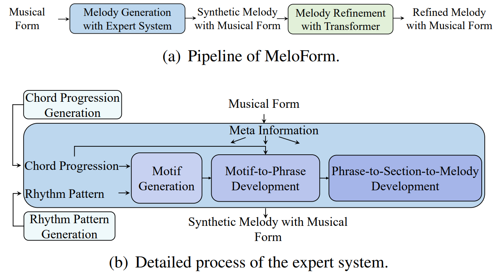
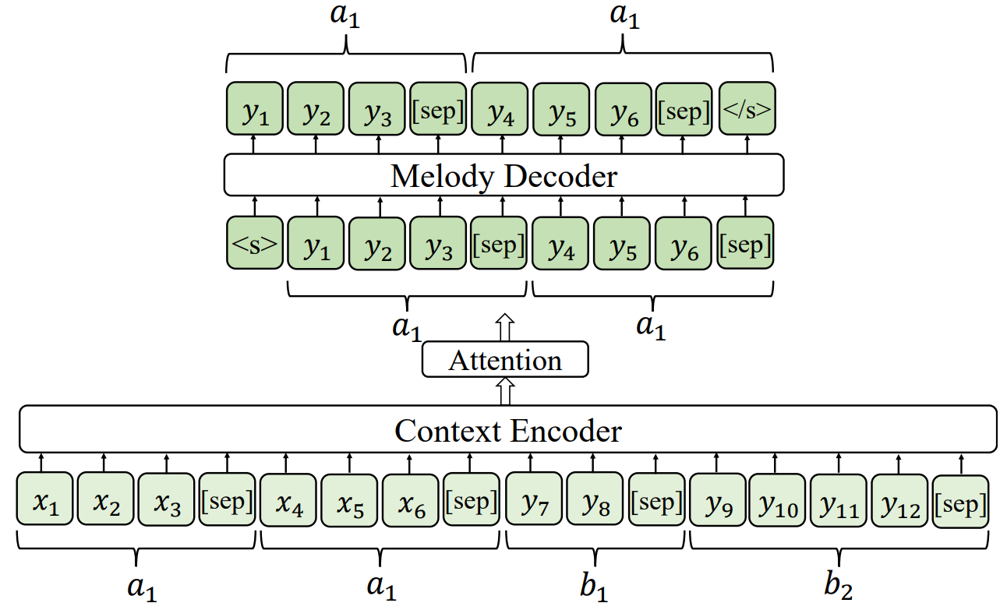
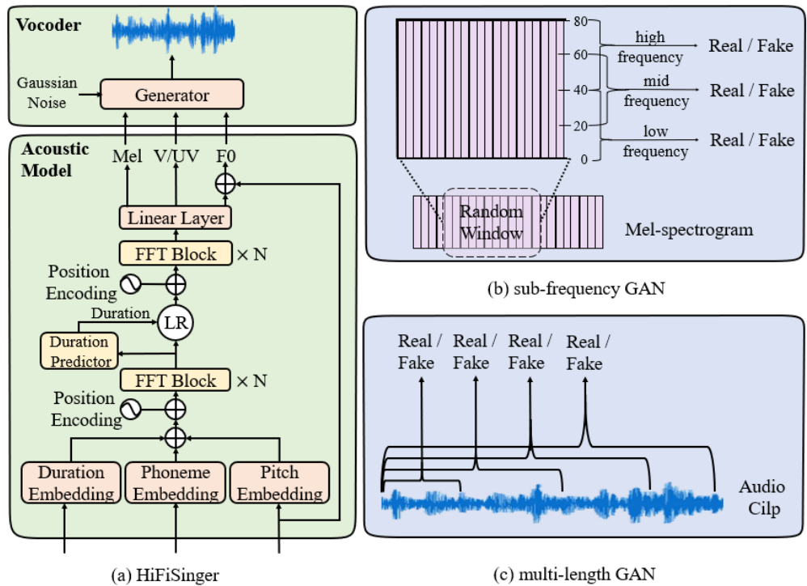

  

 

   
   
  <h3> Please refer to <a href="https://github.com/microsoft/muzic">https://github.com/microsoft/muzic</a> for more information! <h3>

 
    
---
    

   
   
  <h3><a href="https://arxiv.org/abs/2210.10349">
  Museformer: Transformer with Fine- and Coarse-Grained Attention for Music Generation, NeurIPS 2022</a></h3>

 

---
 

   
   
  <h3><a href="https://arxiv.org/abs/2109.09617">
  TeleMelody: Lyric-to-Melody Generation with a Template-Based Two-Stage Method, EMNLP 2022</a></h3>

 

---
 

   
   
  <h3><a href="https://arxiv.org/abs/2107.01875">
  DeepRapper: Neural Rap Generation with Rhyme and Rhythm Modeling, ACL 2021</a></h3>

 

---
 

   
   
  <h3><a href="https://arxiv.org/abs/2012.05168">
  SongMASS: Automatic Song Writing with Pre-training and Alignment Constraint, AAAI 2021</a></h3>

 

---
 

   
   
  <h3><a href="https://arxiv.org/abs/2208.14345">
  MeloForm: Generating Melody with Musical Form based on Expert Systems and Neural Networks, ISMIR 2022</a></h3>

 

---
 

   
   
  <h3><a href="https://arxiv.org/abs/2009.01776">
  HiFiSinger: Towards High-Fidelity Neural Singing Voice Synthesis, arXiv 2020</a></h3>

 

