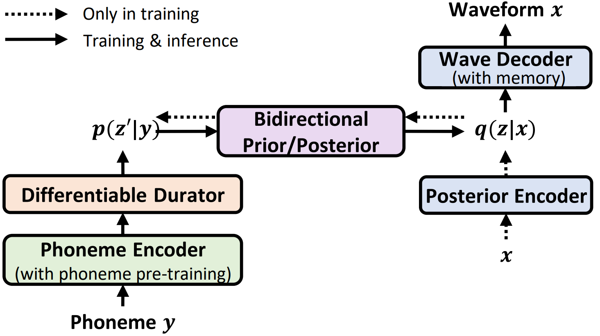
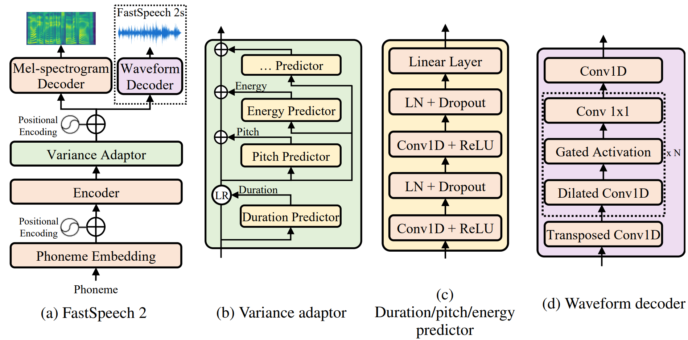
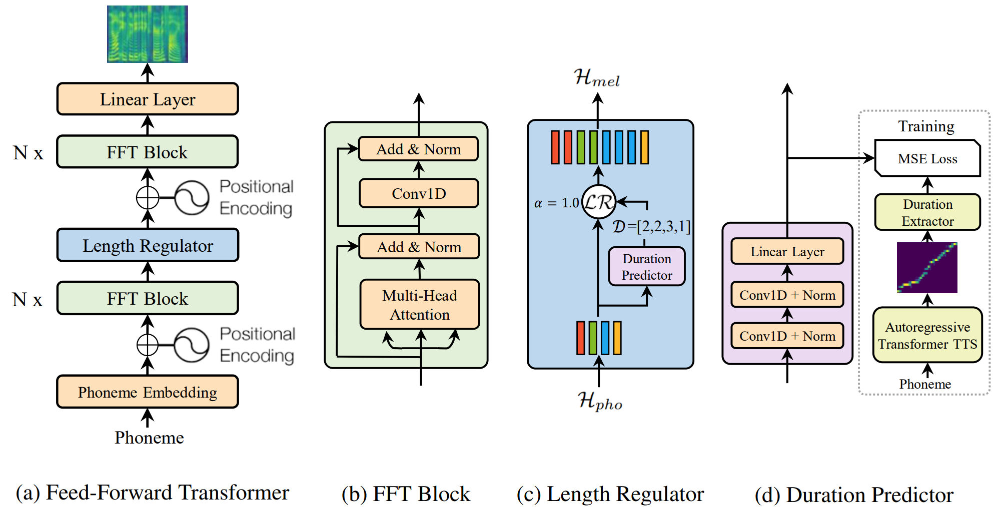
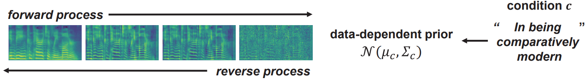
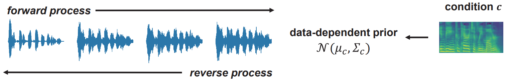
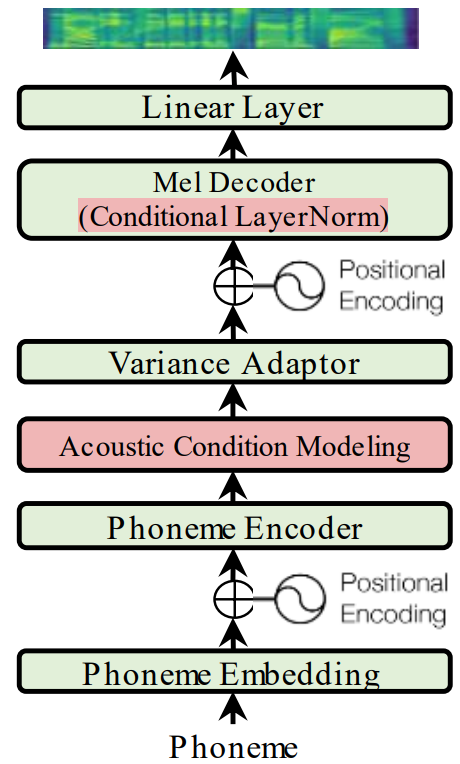
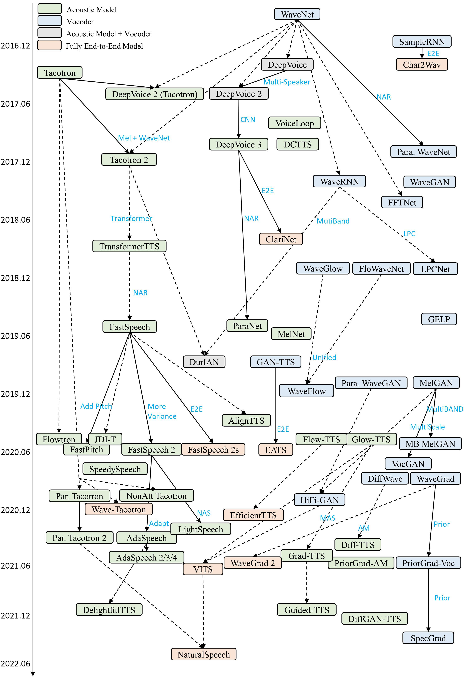
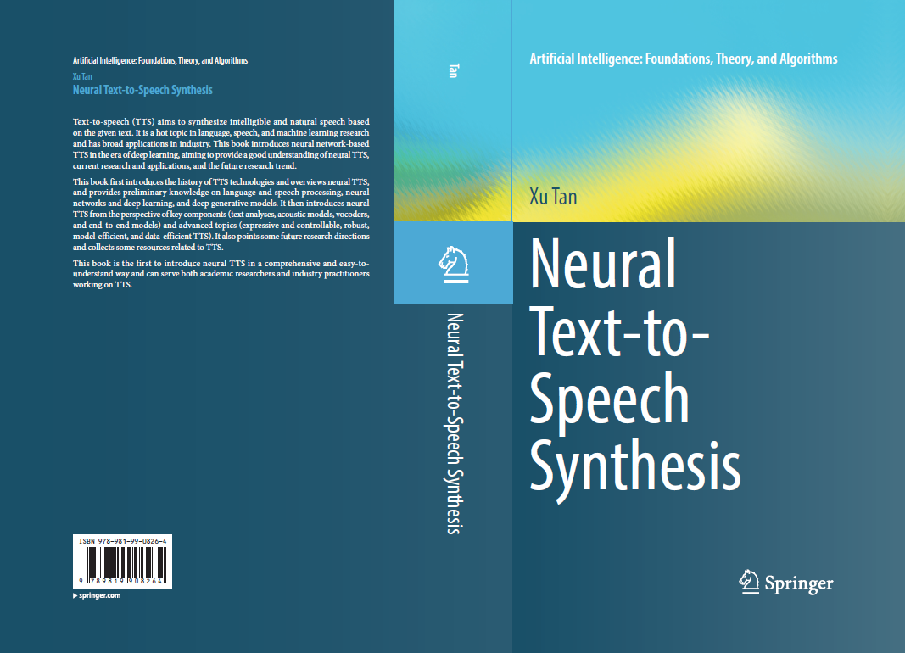

  
  

   
   
  <h3><a href="https://arxiv.org/abs/2205.04421">
  NaturalSpeech: End-to-End Text to Speech Synthesis with Human-Level Quality, arXiv 2022</a></h3>

 

---

   
   
  <h3><a href="https://arxiv.org/abs/2006.04558">
  FastSpeech 2: Fast and High-Quality End-to-End Text to Speech, ICLR 2021</a></h3>

 

---

   
   
  <h3><a href="https://arxiv.org/abs/1905.09263">
  FastSpeech: Fast, Robust and Controllable Text to Speech, NeurIPS 2019</a></h3>

 

---

  <a href="https://arxiv.org/abs/2106.06406">
    PriorGrad: Acoustic Model  
    PriorGrad: Vocoder </a> 
   
  <h3><a href="https://arxiv.org/abs/2106.06406">
  PriorGrad: Improving Conditional Denoising Diffusion Models with Data-Dependent Adaptive Prior, ICLR 2022</a></h3>

 

---

   
   
  <h3><a href="https://arxiv.org/abs/2103.00993">
  AdaSpeech: Adaptive Text to Speech for Custom Voice, ICLR 2019</a></h3>

<h3><a href="https://arxiv.org/abs/2104.09715"> AdaSpeech 2: Adaptive Text to Speech with Untranscribed Data, ICASSP 2021</a></h3>
<h3><a href="https://arxiv.org/abs/2107.02530"> AdaSpeech 3: Adaptive Text to Speech for Spontaneous Style, INTERSPEECH 2021</a></h3>
<h3><a href="https://arxiv.org/abs/2204.00436"> AdaSpeech 4: Adaptive Text to Speech in Zero-Shot Scenarios, INTERSPEECH 2022</a></h3>
 

---

<h3><a href="https://arxiv.org/abs/2110.12612"> DelightfulTTS: The Microsoft Speech Synthesis System for Blizzard Challenge 2021, Blizzard Challegnge 2021</a></h3>
<h3><a href="https://arxiv.org/abs/2207.04646"> DelightfulTTS 2: End-to-End Speech Synthesis with Adversarial Vector-Quantized Auto-Encoders, INTERSPEECH 2022</a></h3>
 

---

   
   
  <h3><a href="https://arxiv.org/abs/2106.15561">
  A Survey on Neural Speech Synthesis, arXiv 2021</a></h3>

 

---
<h3><a href="https://github.com/tts-tutorial"> Tutorial on Speech Synthesis at ISCSLP 2021, IJCAI 2021, ICASSP 2022, INTERSPEECH 2022</a></h3>
 

---
<h3><a href="https://github.com/microsoft/NeuralSpeech"> NeuralSpeech: an opensource repo on speech</a></h3>
 

---

   
   
  <h3><a href="https://link.springer.com/book/9789819908264">
  A Book on Neural Text-to-Speech Synthesis </a></h3>

 
