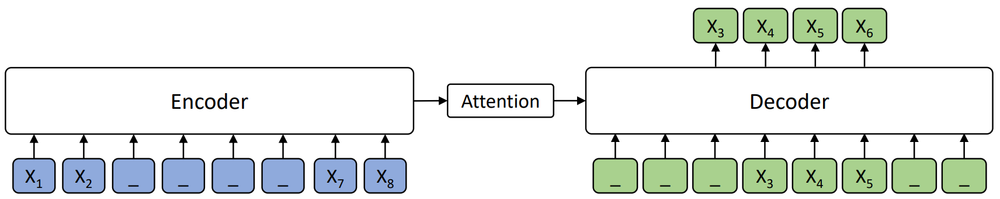

  

   
   
  <h3><a href="https://arxiv.org/abs/1905.02450">
  MASS: Masked Sequence to Sequence Pre-training for Language Generation, ICML 2019</a></h3>

 

---

 

   
   
  <h3><a href="https://arxiv.org/abs/1803.05567">
  Achieving Human Parity on Automatic Chinese to English News Translation, arXiv 2018</a></h3>

 

